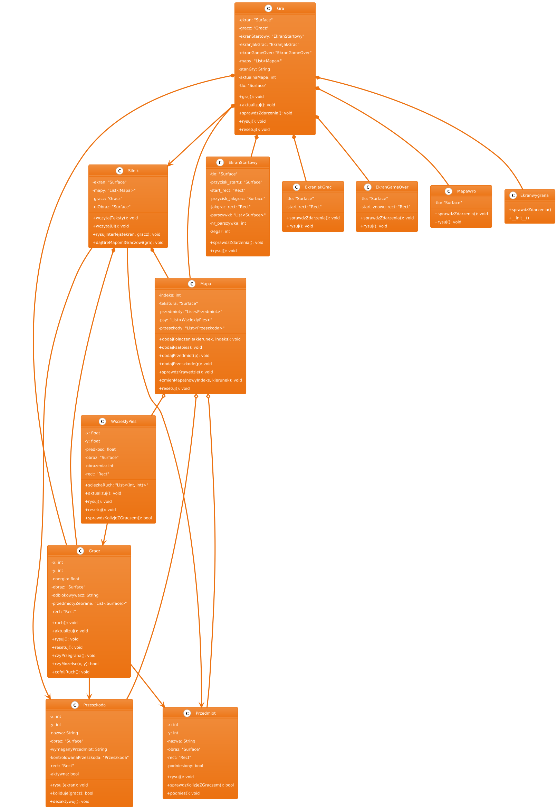

# projekt-gra
# "Parszywek we Wrocławiu"

**skład drużyny** – Patrycja Krzyżostaniak, Agnieszka Musiał, Maria Młynarczyk, Maja Wiączek, Emilia Pawlak

**data oddania** – 23.06.2025r

---

Nasza gra będzie o szczurze Parszywku, który zmierza na imprezę urodzinową kolegi – Siwka. Parszywek będzie się poruszał po wyznaczonych miejscach we Wrocławiu i szukał prezentu. Gra będzie wzorowana na Harry the Hamster 2.

Zdecydowałyśmy się na taki projekt ze względu na nostalgię związaną z tą grą – każda z nas ją dobrze wspomina. W dodatku, dyskutując o projekcie, czerpiemy przyjemność z ustalania kreatywnych i humorystycznych elementów. Ponadto mamy okazję przybliżyć sobie topografię Wrocławia.

**Biblioteki, które mogą się przydać to:**  
pygame, math, os, sys

---

## do diagramu użyto: 
https://www.plantuml.com/plantuml/uml/SyfFKj2rKt3CoKnELR1Io4ZDoSa700003 
### Zadania do wykonania:

- zaimplementowanie ruchu Parszywka i sterowania z klawiatury (lewo, prawo, góra, dół)
- budowa map i połączeń pomiędzy nimi
- zaimplementowanie zbierania przedmiotów (np. odblokowujących części mapy, a co za tym idzie, wcześniejsze zablokowanie pewnych przejść aż do zdobycia odpowiednich przedmiotów)
- przygotowanie grafik
- dodanie menu startowego/końcowego oraz efektów dźwiękowych i muzyki w tle
### Do grafik użyto:
- Goodnotes 5 
- ikony Apple emoji
- Sketchbook
- mapa : https://pl.wikipedia.org/wiki/Podział_administracyjny_Wrocławia#/media/Plik:Rozw-teryt-WROC.png
- fotografie: własne
